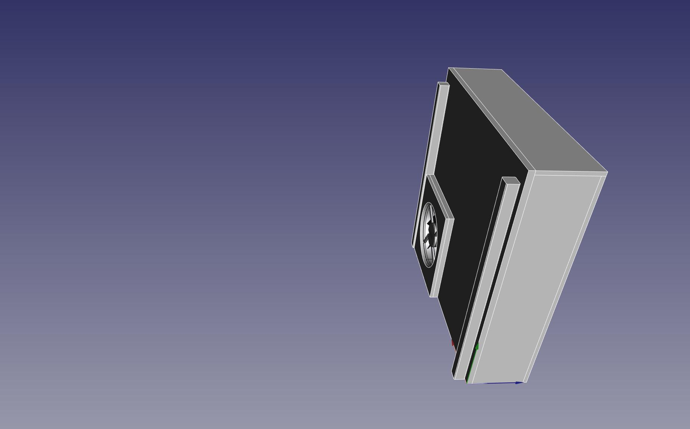
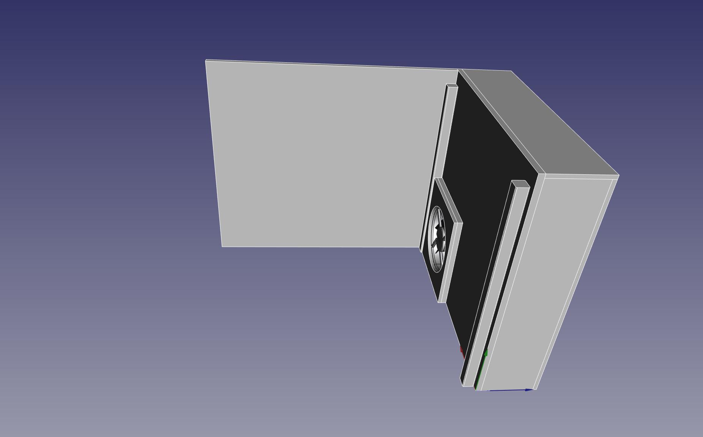
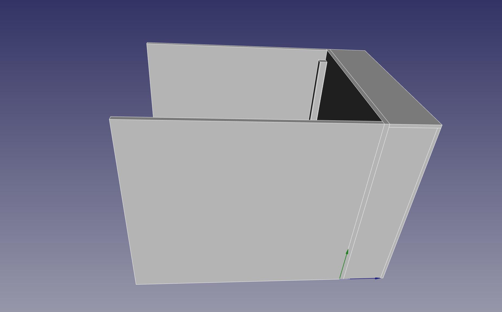
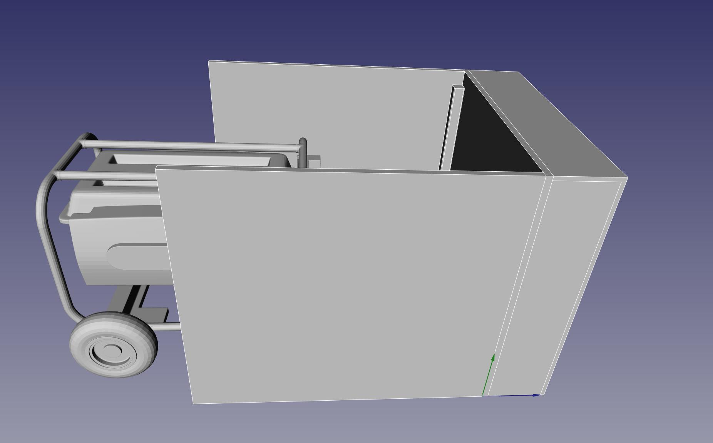
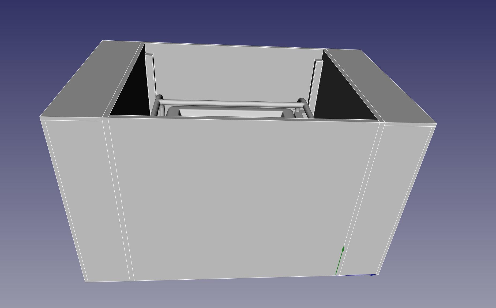
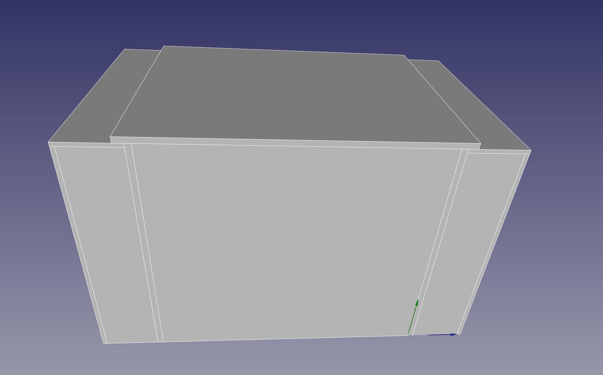
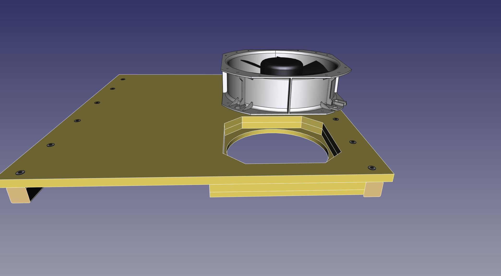
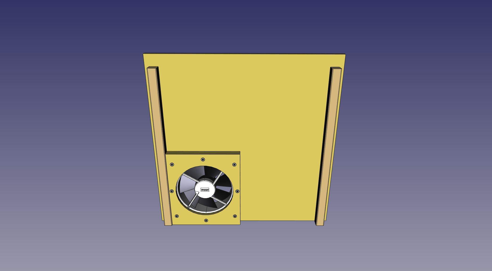
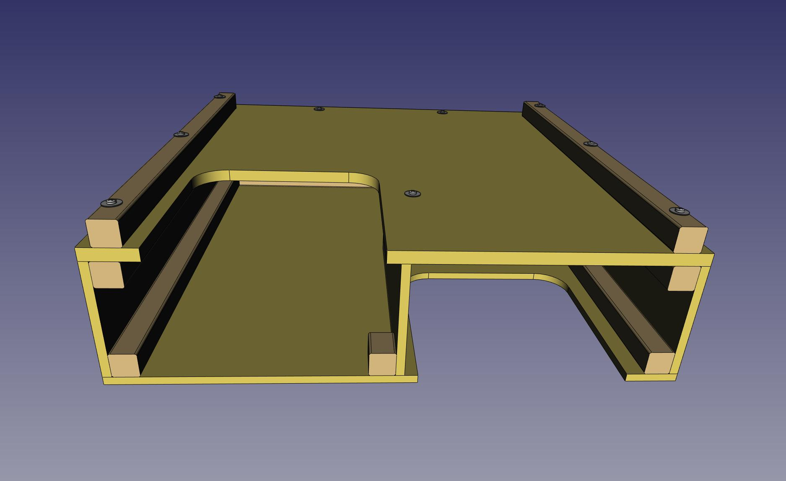
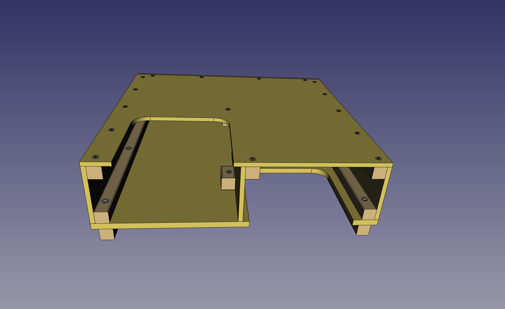

# GenBox
Generator Enclosure that's both quiet and ventilated.

||
|:---:|
||

| Steps to Deploy |
| --- |
|  |
|  |
|  |
|  |
|  |
|  |

## Building

| Baffle Box. Build 2 identical copies of this |
| --- |
|  |
|  |
|  |
|  |
|  |
|  |
|  |
|  |
|  |

| Inlet Wall |
| --- |
|  |
|  |
|  |
|  |

| Inlet Box |
| --- |
|  |
|  |
|  |
|  |

| Outlet Box |
| --- |
|  |
|  |
|  |
|  |

| Lid |
| --- |
|  |
|  |
|  |

<b>Photos: https://goo.gl/photos/VuZsvcwMcuBNV2xo6<b>

## Theory of Operation
* The main interior box is simple, with no exhaust piping breaking the barrier from inside to outside.  
 This gives several advantages:  
  Flexible: You can use any generator that fits, because there is no exhaust piping which would need to be custom fit.  
  Simple to use: You don't need to do anything special to fit the generator.
  Quieter: Fewer holes in the main box, and no parts breaching from inside to outside, which would transmit noise from inside to outside (exhaust piping).  
  More weather resistant: Fewer seams to leak.

* The simple interior box means that heat and exhaust gas must be actively vented with a non-trivial fan.  
 So, there is a non-trivial fan built in to the inlet wall. The fan is on the inlet wall rather then the outlet, so that the fan does not have to deal with the heat and corrosiveness of the exhaust gas. The placement of the fan also naturally protects it from weather, lets the baffle box block the sound from the fan itself as well as the generator, and protects kids and pets and yourself from the fan blades. The fan is very powerful and the blades are steel. The fan is dangerous.

* Sound is prevented from projecting out of the inlet and outlet openings by simply being forced around a 180 degree bend. Both the inlet and outlet baffle boxes have a simple arrangement where the air enters on the bottom-left, exits on the bottom-right, and goes over a wall half-the height of the box in between, forming a large, not-very-restrictive, yet still 180 degree turn. The inside surfaces of the baffle boxes are also lined with thin indoor-outdoor carpet, to reduce sound reflection off the plywood surfaces without restricting airflow.
 
 Air passes fairly easily around the bend and through the box, sound is mostly stopped at the bend.
 
 * The lid has an internal lip that goes all the way around, which covers the gap between the lid and the walls.
 
 * There is no bottom. You just place the generatore and the box directly on grass or dirt, or, for hard flat surfaces put down a cheap 3x5 carpet.
 
 * Saftey wrt the fan and heat: The fan is a harsh environment model and very robust, but it is still a point of failure, but not a source of danger from overheating when the fan fails. When the fan fails, the generator quickly consumes all the oxygen in the box and dies before getting much hotter. If the fan were to become merely weak/slow without stopping altogether, that could be a problem.
 
 * Safety wrt the exhaust being inside the box: The exhaust blows directly against one inside wall from only a few inches away. There is heat shielding on that spot, shown in the some pictures in the photo album, not shown in the CAD drawing yet.  

## Design Goals
* Quiet  
 Achieved mainly by focing the inlet and outlet air around a 180 degree bend.  
 Also by having no breakes in the main box where sound can transmit out, for instance, exhaust piping.  
 Carry handles and lid-lifting handle made of tow strap, which does not rattle.

* Simple usage
 No special piping to run the exhaust out of the box. Exhaust dumps right inside the box with no modifications or custom piping to the generator.  
 This means you just stick any generator that fits inside. If your Generator dies and you replace it with a different model, no problem.

* Weatherproof  
 Again, no openings in the main box. Simple full unbroken sheets of pressure treated plywood with heavy deck paint.  
 The top surfaces cover the vertical seams.  
 All pressure treated lumber and stainless steel hardware.  

* Active ventilation
 This is a major point. With the exhaust dumping inside the box, It's critical to push a lot of air through to keep the generator (and the gas tank!) cool enough.  
 In trade for being able to have everything else be simple to source, build, and use, the one special component of the whole kit is the fan.  
 The fan is special in that it moves over 1100 cfm while being only 10" around. There isn't room to fit a fan much larger.  
 You probably have to order it on-line, and it will cost about $160 USD before tax & shipping.  

 The fan runs on AC for, simplicity, efficiency, reliability, maintainability. There are more readily available fans than the special one used, and possibly cheaper, that push the same cfm while being in the same 10-12" size range, in the form of automotive radiator fans. But those require a very beefy DC power supply, which introduces probably 10 different problems and disadvantages.

* Portable  
 The box breaks down into 5 main parts for travel or storage. The inlet and outlet baffle boxes, the front & back panels, and the lid.

* Simple to source materials and simple to build. Everything but the fan can come right from any hardware/lumber store. Cuts are mostly simple straight & square cuts. Raw materials are just 2 sheets of 3/4" plywood, 1 sheet of 1/2" plywood, a few lengths of 2x2, and a few feet of 1x1 angle iron.

* Smooth surfaces. Meaning, no handles or latches that stick out.  
 They catch on things like, your thigh.  
 They damage other things during packing and travel.  
 They get damaged by other things during packing and travel and during use.  

## Performance
* Sound: I don't have objective sound measurements. The video suffers from automatic gain control, which tries to make everything sound the same loudness, so you can't really use it to tell the difference between with & without the box, except by a secondary effect by listening to the audiobook in the background. Without the box, the book is inaudble. With the box, you can hear the book, which itself is not very loud.

* Temperature: Temperature stays around 120F or lower as long as the lid is closed, even in 90 degree ambient weather. The temperature goes up drastically when the lid is open, because the air from the fan is not being forced across the generator and out the outlet. It's free to escape upwards right near the fan, and the air around the generator remains largely trapped and relatively still. So keep the lid closed while running except for short durations to refuel or connect cables. (Surely every generator manual says to shut down during refueling anyway.)

 The heat shielding where the mufler blows on the inside wall has turned out to be good enough. That spot on the wall does get warm, obviously, but it never gets more than warm. You can press your palm right on that spot and keep it there indefinitely. If it's not hot enoughh to make you pull your hand away, then it's not even remotely close to combustion. The exhaust gas has disintigrated the edge of the carpeting surroundinging the heat shield, so perhaps the heat shield could be a bit larger, or perhaps incorporate a lip to deflect the spillover away from the carpet a little.

* Longevity: The unit in the video is now over 5 years old, and has been sitting, assembled, outside at the corner of my house for all that time, with the generator inside it. The generator and the fan are still both fine. The wood is all still solid. The deck paint has started to flake off and moss has grown all around the base on the 3x5 carpet and the bottom few inches of wood. The heat from the exhast has degraded the shag carpet on the inside wall right where the exhaust blows.

## Build Plans
Currently the only plans are the FreeCAD file and the pictures in the Google Photos album. The photo album includes a few pictures of some hand drawn sketches. A few of the dimensions are slightly wrong on those drawings. Refer to the FreeCAD model for actual dimensions. Refer to those pictures for the general layout of how to arrange the pieces to cut from the plywood sheets. I will be making up some build plans from the cad model shortly.

## Materials
(incomplete list)

* Fan: https://www.mouser.com/ProductDetail/Orion-Fans/OA280AN-11-1TB18?qs=d%2Fd7jy5RWDpBQnumC7OAIg%3D%3D  
 If you want to look for other fans: You need a fan that fits in the available space and can push at least 1100 CFM.  
 Here are a few drop-in replacement model numbers:  
 https://www.mouser.com/ProductDetail/Qualtek/FDA2-28080NBHK4F?qs=AAveGqk956HBL0KfxwrxvA%3D%3D  
 https://www.mouser.com/ProductDetail/ebm-papst/W2E250-HJ32-01?qs=kakCB4mkm8p8%2FT7UZOSVHA%3D%3D  

* 2 x 4x8 sheet 3/4" pressure treated plywood

* 1 x 4x8 sheet 1/2" pressure treated plywood

* ?? feet 2x2 pressure treated

* ?? feet 1x1x1/8 angle iron
 (TODO: show on drawings, goes inside short frame rails on lid to prevent warping from rain)

* exterior wood glue

* ?? lbs 1 1/4" #8 stainless wood screw  
  ?? #8 stainless washers  

1/4-20 stainless screws (long)  
1/4" stainless whashers  
1/4-20 stainless T-nuts  
anti-seize  

carpet  
staples  
heat shield  
alu flat stock and tow strap for handles  
... more

 

## TODO
* Power cord routing and access to outlets  
* Lid prop  
* Light  
* Better tool storage  
* Wireless thermometer (maybe grill thermometer?)  
* Generator cord winding pegs on the non-exhaust side panel? Don't want pegs which stick out during storage, so they have to fold out or be removable  
* Plans & Directions for building.  
 Plywood sheet cuts layouts.  
 Sequence, what attaches to what first. Which parts go together in sub-assemblies.  
 Placement of drill holes, wood screws, T-nuts & machine screws.  
 Assembly/disassembly.  
 Demonstrate features such as removable outer boxes, fan replacement.
* Y power cord with dual Nema 5-15P plugs to get 220v from two 110v outlets for a 220v fan. This would allow using a more efficient 220v fan, and spread the load from the fan evenly across both windings, while still leaving the twist-lock connector free for the main genertor cord.
